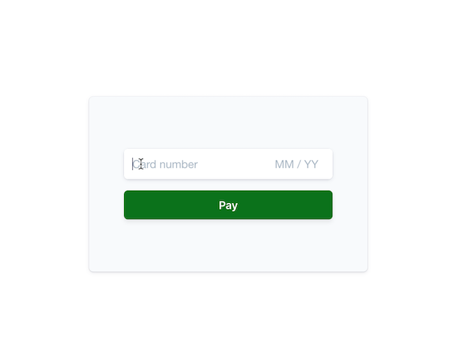

# Collecting a card payment on the web 
Charging a card consists of three steps:

**🕵️ Authentication -** Card information is sent to the card issuer for verification. Some cards may require the cardholder to strongly authenticate the purchase through protocols like [3D Secure](https://stripe.com/ie/guides/3d-secure-2). 

**💁 Authorization -** Funds from the customer's account are put on hold but not transferred to the merchant. 

**💸 Capture -** Funds are transferred to the merchant's account and the payment is complete.

The [Payment Intents API](https://stripe.com/docs/api/payment_intents) abstracts away these three stages by handling all steps of the process through the [confirm method](https://stripe.com/docs/api/payment_intents/confirm). After you create a PaymentIntent, call confirm to authenticate, authorize, and capture the funds in one API call.

**Demo**

See a [hosted version](https://hhqhp.sse.codesandbox.io/) of the sample or fork a copy on [codesandbox.io](https://codesandbox.io/s/stripe-sample-web-elements-card-payment-hhqhp)

The demo is running in test mode -- use `4242424242424242` as a test card number with any CVC code + a future expiration date.

Use the `4000000000003220` test card number to trigger a 3D Secure challenge flow.

Read more about testing on Stripe at https://stripe.com/docs/testing.




There are two implementations depending on whether you want to use webhooks for any post-payment process: 
* **[/using-webhooks](/using-webhooks)** Confirms the payment on the client and requires using webhooks or other async event handlers for any post-payment logic (e.g. sending email receipts, fulfilling orders). 
* **[/without-webhooks](/without-webhooks)** Confirms the payment on the server and allows you to run any post-payment logic right after.

This sample shows:
<!-- prettier-ignore -->
|     | Using webhooks | Without webhooks
:--- | :---: | :---:
💳 **Collecting card and cardholder details.** Both integrations use [Stripe Elements](https://stripe.com/docs/stripe-js) to build a custom checkout form. | ✅  | ✅ |
🙅 **Handling card authentication requests and declines.** Attempts to charge a card can fail if the bank declines the purchase or requests additional authentication.  | ✅  | ✅ |
↪️ **Using webhooks to respond to a hold being placed on the card.** Confirming the payment on the client requires using webhooks for any follow up actions, like emailing a receipt. | ✅ | ❌ |
🏦 **Easily scalable to other payment methods.** Webhooks enable easy adoption of other asynchroneous payment methods like direct debits and push-based payment flows. | ✅ | ❌ |


## How to run locally

This sample includes 5 server implementations in Node, Ruby, Python, Java, and PHP for the two integration types: [using-webhooks](/using-webhooks) and [without-webhooks](/without-webhooks). 

Follow the steps below to run locally.

**1. Clone the repository:**

```
git clone https://github.com/stripe-samples/web-elements-card-payment
```

**2. Copy the .env.example to a .env file:**

```
cp .env.example .env
```

You will need a Stripe account in order to run the demo. Once you set up your account, go to the Stripe [developer dashboard](https://stripe.com/docs/development#api-keys) to find your API keys.

```
STRIPE_PUBLIC_KEY=<replace-with-your-publishable-key>
STRIPE_SECRET_KEY=<replace-with-your-secret-key>
```

`CLIENT_DIR` tells the server where to the client files are located and does not need to be modified unless you move the server files.

**3. Follow the server instructions on how to run:**

Pick the server language you want and follow the instructions in the server folder README on how to run.

For example, if you want to run the Node server in `using-webhooks`:

```
cd using-webhooks/server/node # there's a README in this folder with instructions
npm install
npm start
```

**4. [Optional] Run a webhook locally:**

If you want to test the `using-webhooks` integration with a local webhook on your machine, you can use the Stripe CLI to easily spin one up.

First [install the CLI](https://stripe.com/docs/stripe-cli) and [link your Stripe account](https://stripe.com/docs/stripe-cli#link-account).

```
stripe listen --forward-to localhost:4242/webhook
```

The CLI will print a webhook secret key to the console. Set `STRIPE_WEBHOOK_SECRET` to this value in your .env file.

You should see events logged in the console where the CLI is running.

When you are ready to create a live webhook endpoint, follow our guide in the docs on [configuring a webhook endpoint in the dashboard](https://stripe.com/docs/webhooks/setup#configure-webhook-settings). 


## FAQ
Q: Why did you pick these frameworks?

A: We chose the most minimal framework to convey the key Stripe calls and concepts you need to understand. These demos are meant as an educational tool that helps you roadmap how to integrate Stripe within your own system independent of the framework.

Q: Can you show me how to build X?

A: We are always looking for new sample ideas, please email dev-samples@stripe.com with your suggestion!

## Author(s)
[@adreyfus-stripe](https://twitter.com/adrind)
